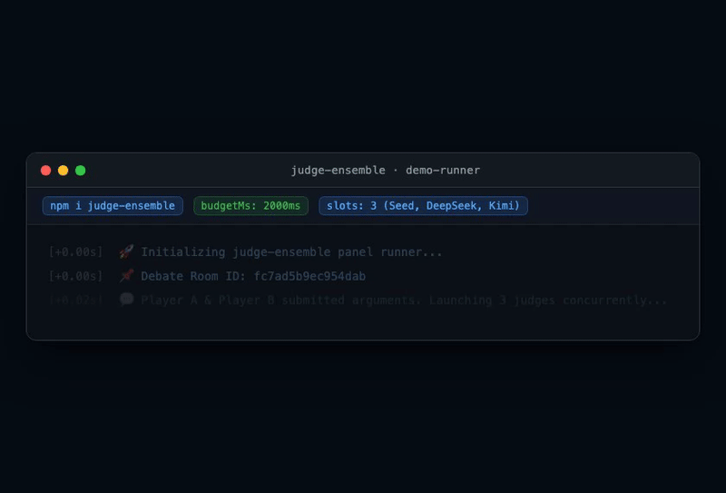

# judge-ensemble

Run N concurrent judges (LLM or otherwise) under a hard time budget — **always get exactly N labeled results**, streamed as they land.

> Extracted from and battle-tested in [AI Judge](https://ai-judge.ai), a multi-model AI debate platform where it judges every round in production.

## Install

```bash
npm i judge-ensemble
```

Node.js >= 18. Zero runtime dependencies. ESM + CJS dual entry, fully typed.

## Use cases

**[Multi-model AI evaluation](docs/use-cases.md#1-multi-model-ai-evaluation-the-home-turf)** — the home turf: debate verdicts, essay grading, code review, RAG correctness. Every verdict labeled `real`/`substitute`/`fallback`, so analytics never mistake a degraded result for a genuine judgment.

```ts
const results = await runPanel({
  slots: ['grammar-judge', 'factual-judge', 'style-judge'],
  budgetMs: 20_000,
  // ...
});
// one model down? still exactly 3 results:
// [
//   { slot: 'grammar-judge', via: 'real',       result: { score: 87, rubric: 'grammar' } },
//   { slot: 'factual-judge', via: 'substitute', result: { score: 91, rubric: 'factual' } },
//   { slot: 'style-judge',   via: 'fallback',   result: { score: 0,  rubric: 'style', unavailable: true } },
// ]
```

**Other scenarios where the same guarantees pay off** (full write-ups in [docs/use-cases.md](docs/use-cases.md)):

- **Multi-provider failover** — parallel requests across OpenAI/Anthropic/self-hosted with per-provider timeouts; the abort chain (budget → retry → call → HTTP request) never keeps burning tokens after they lose value
- **Real-time UI** — `onResult` streams each result the instant it lands (WebSockets/SSE), and late completions after budget expiry are never double-emitted
- **Content moderation** — every check dimension yields a verdict; failures degrade to `manual-review` fallbacks instead of crashing the request
- **Multi-source aggregation / microservice fan-out** — price comparison, travel quotes, multi-region reads; stable result shape under partial degradation
- **Multi-agent workflows** — the reliability execution layer beneath your aggregation (not a framework: prompts, memory, voting stay yours)

## Install

```bash
npm i judge-ensemble
```

Node.js >= 18. Zero runtime dependencies. ESM + CJS dual entry, fully typed.

## What it guarantees

- **Exactly one result per slot, ever** — real (`via: 'real'`), substitute (`via: 'substitute'`), or fallback (`via: 'fallback'`), labeled. Late completions after budget expiry are dropped, never double-emitted.
- **Completed results survive budget expiry.** When the overall deadline hits, the panel resolves immediately with survivors + labeled fallbacks — in-flight calls keep aborting in the background.
- **Abort cascades.** Budget expiry aborts every in-flight call's `AbortSignal` (cancel real HTTP requests, don't burn tokens) and cuts retries mid-sleep.
- **Substitute dedup.** A target is never assigned twice — the substitute pool is seeded with every resolvable primary slot's `targetKey`, and each claimed substitute is excluded as it's taken.
- **Streaming.** `onResult(result, completed, total)` fires as each judge finishes, in completion order. Callback crashes never break the panel.
- **Error discrimination.** Only a genuine budget expiry degrades to fallback filling; unexpected internal errors propagate to the caller instead of being silently masked.

<p align="center">
  
</p>

## Quick start

```ts
import { runPanel } from 'judge-ensemble';

const results = await runPanel({
  slots: ['gpt-4o', 'claude', 'gemini'],
  budgetMs: 40_000,
  retry: { maxAttempts: 3, baseDelayMs: 500, maxDelayMs: 5_000 },

  resolveSlot: (id) => getModel(id),           // your roster lookup
  isOnline: (m) => m.online,
  targetKey: (m) => m.id,                      // dedup key
  describeTarget: (m) => m.name,
  callTimeoutMs: (m) => m.reasoning ? 30_000 : 15_000,
  call: (m, signal) => judge(m, prompt, signal),  // your call — honor the signal
  decorate: (result, m) => ({ ...result, judge: m.name }),
  fallback: (slot) => ({ judge: slot, verdict: 'unavailable' }),
  findSubstitute: (assigned) => pickUnusedModel(assigned),
  onResult: (r, done, total) => socket.emit('judgment-partial', r),
});

// results.length === 3, always — each { slot, via: 'real'|'substitute'|'fallback', result }
```

## Why not `Promise.allSettled` + a timeout wrapper?

1. `allSettled` gives you *eventual* results; your UI needs *guaranteed, bounded* results. When the budget expires, the panel resolves immediately with survivors + labeled fallbacks.
2. Naive timeouts leak: the wrapped promise stays pending, the HTTP call keeps burning tokens. Here every layer receives an `AbortSignal` and the cascade aborts retries mid-sleep, calls mid-flight.
3. "One result per slot" is a real invariant that fails in subtle ways (late completions after timeout, duplicate substitute assignment, double-emitted callbacks). These are locked by 58 tests.

## API

### `runPanel<T, M>(opts): Promise<PanelResult<T>[]>`

The concurrent panel runner. `T` is your result type, `M` your target (model/endpoint) type.

| Option | Required | Description |
|---|---|---|
| `slots` | ✓ | Slot identifiers; one result each, duplicates each get a result |
| `budgetMs` | ✓ | Overall deadline for the whole panel |
| `retry` | ✓ | `{ maxAttempts, baseDelayMs, maxDelayMs }`, optional `onRetry` observer |
| `resolveSlot(slot)` | ✓ | Slot → primary target; `undefined` = unknown slot → fallback |
| `isOnline(target)` | ✓ | Offline targets go straight to substitution |
| `targetKey(target)` | ✓ | Dedup key for primary + substitute assignment |
| `describeTarget(target)` | ✓ | Name used in timeout error messages |
| `callTimeoutMs(target)` | ✓ | Per-call deadline (e.g. larger for reasoning models) |
| `call(target, signal)` | ✓ | Invoke the target; return `null` for unusable response |
| `decorate(result, target, via, slot)` | ✓ | Stamp metadata (judge name, `substitutedFor`, …) |
| `fallback(slot, cause)` | ✓ | Fallback result factory. Contract: must not throw |
| `findSubstitute(assignedKeys)` | ✓ | Pick an unused substitute; `undefined` = none |
| `onTargetError(target, error)` | | Observe primary failures (health checks, metrics) |
| `onResult(pr, completed, total)` | | Stream each result as it lands; crashes are swallowed |
| `onBudgetExceeded(error, collected)` | | Observe budget expiry; crashes are swallowed |

`PanelResult<T> = { slot: string; via: 'real' | 'substitute' | 'fallback'; result: T }`

Fallback causes: `'unknown-slot' | 'online-failure' | 'offline-failure' | 'budget'`.

A genuine budget expiry rejects internally with `BudgetExpiredError` (exported for `instanceof` checks via `onBudgetExceeded`). Any other internal error propagates out of `runPanel` — the library never masks real bugs with fallbacks.

### `withRetry(fn, options, parentSignal?)`

Exponential backoff with jitter, interruptible sleeps, retryable-error classification (rate limits, timeouts, 5xx, network errors). `options.onRetry` observes each scheduled retry. Parent abort stops retries immediately.

### `withTimeout(promiseOrFactory, ms, message?, parentSignal?, errorFactory?)`

Timeout that accepts a promise or a `(signal) => Promise` factory. Factories get an `AbortSignal` that aborts on timeout — cancel the underlying HTTP request with it. Parent aborts cascade: the child signal aborts *and* the race rejects immediately. All listeners are detached when the race settles (no leaks on long-lived parent signals).

### `categorizeError(error)`

Classifies an error as `'rate_limit' | 'quota_exceeded' | 'auth_error' | 'network' | 'unknown'` for smarter fallback decisions.

## Status

0.x — API may change. CI runs on Node 18/20/22.

## License

MIT
